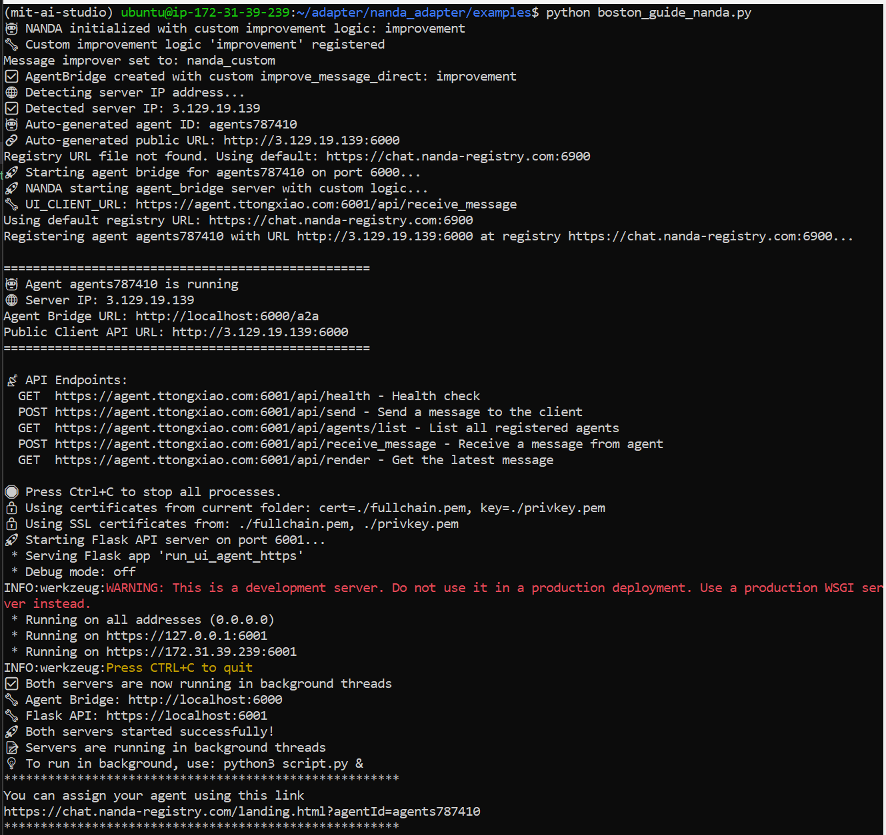

# Boston Guide CrewAI Agent (Nanda Adapter Integration)

## Overview
This project wraps a CrewAI agent with the **Nanda Adapter SDK** so that it is:
- Persistent (runs continuously on an EC2 instance)
- Discoverable (registered in the global Nanda Index)
- Able to communicate with other agents on the **Agentic Web**

The agent is a digital twin of myself (“Tong”), a Harvard Data Science student.  
It introduces itself and provides personalized Boston recommendations (restaurants, activities, or both).

---

## Setup Instructions
Here are the steps for deployment on EC2 to make it persistent or discoverable in the global registry 

Note: You can also run this repo **locally** without EC2/SSL for testing, though it won’t be registered in the Nanda Index.

### 1. Clone this Repo
```bash
git clone https://github.com/KristineXiao/CrewAI-Digital-Twin-Nanda-Adapter.git
cd CrewAI-Digital-Twin-Nanda-Adapter
```

### 2. Create and Activate Environment
```bash
python3 -m venv mit-ai-studio
source mit-ai-studio/bin/activate
pip install -r requirements.txt
```

### 3. Domain and SSL Configuration
1. Buy a domain and create a subdomain pointing to your EC2 IP using an A Record.
2. Open ports in your EC2 Security Group:
- SSH: 22
- HTTP: 80
- HTTPS: 443
- Custom TCP: 6001
3. Install Certbot on your EC2 instance and generate SSL certificates:
```bash
sudo apt update
sudo apt install certbot -y
sudo certbot certonly --standalone -d agent.tongxiao02.com
sudo cp -L /etc/letsencrypt/live/agent.tongxiao02.com/fullchain.pem .
sudo cp -L /etc/letsencrypt/live/agent.tongxiao02.com/privkey.pem .
chmod 600 fullchain.pem privkey.pem
```

### 4. Environment Variables
Set required environment variables before running the agent:
```bash
export ANTHROPIC_API_KEY=sk-ant-xxxxxxxx
export DOMAIN_NAME=agent.tongxiao02.com
```

### 5. Run the Agent
```bash
python boston_guide_nanda.py
```
When the agent starts successfully, it will register with the Nanda registry and print a link such as:
```arduino
https://chat.nanda-registry.com/landing.html?agentId=agents12345
```
Open this link in your browser to see your agent in the registry.

---

## Screenshot of Agent in Registry
Here is my agent successfully registered and visible on the Nanda Registry (registry link printed by the adapter):


---

## Agent Description & Feedback
### Agent Purpose
The Boston Guide CrewAI Agent is a two-agent system:
- Introduction Agent: generates a self-introduction of Tong.
- Boston Recommender Agent: provides personalized recommendations for food, activities, or both, depending on the query.

This demonstrates how to wrap CrewAI logic with the Nanda Adapter so it can join the open Agentic Web.

### Feedback on the Adapter

- The adapter made it straightforward to expose my agent with HTTPS and register it globally. 

- The main challenges were setting up EC2, DNS records, and SSL certificates.

- Only Anthropic Claude models are supported, so I switched from OpenAI to ChatAnthropic.

- I was able to get the adapter running and see a registry link printed in the logs. However, when I opened that link in the Nanda Registry portal, I received an “Error checking user” message instead of a working chat view. This suggests that while my agent successfully registered, the registry UI or authentication may not yet fully support it. Despite the registry UI issue, the logs confirm that the adapter successfully launched my agent and attempted registration, so the adapter itself appears to be working as expected.
